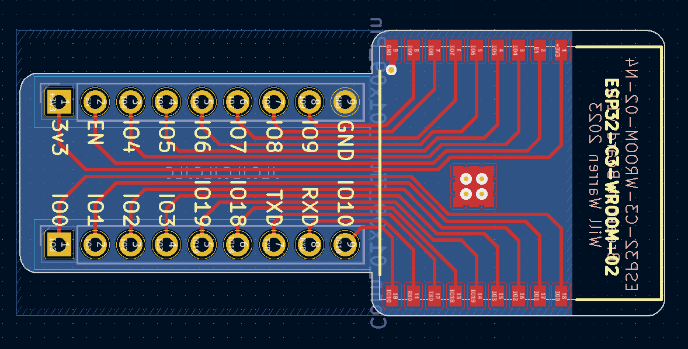

# Breakout Board for ESP32-C3-WROOM-02

This repo contains all the design files to make a breakout board for the ESP32-C3-WROOM-02-N4 and ESP32-C3-WROOM-02U-N4 which will allow you to use the ESP module on a breadboard.

The project was created using KiCAD v7.

Read more about the project and see more photos here: <https://willwarren.com/2023/12/06/breakout-board-esp32-c3-wroom-02-wifi-module/>

## License

This repo is licensed under the [Attribution-ShareAlike 4.0 license (CC BY-SA 4.0)](https://creativecommons.org/licenses/by-sa/4.0/)

